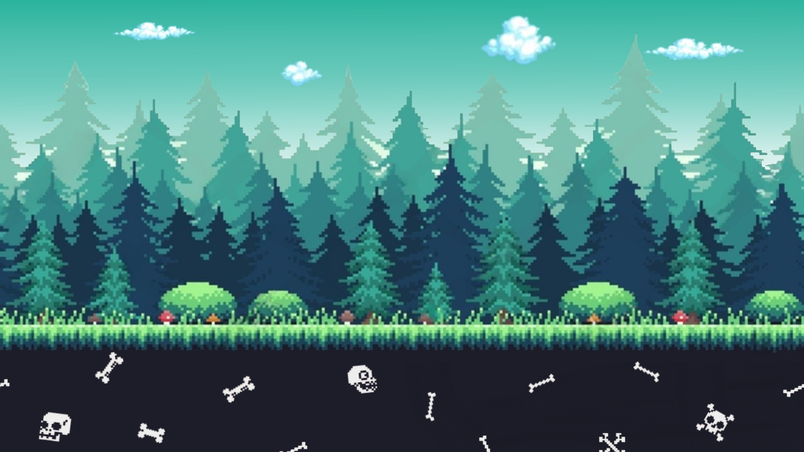
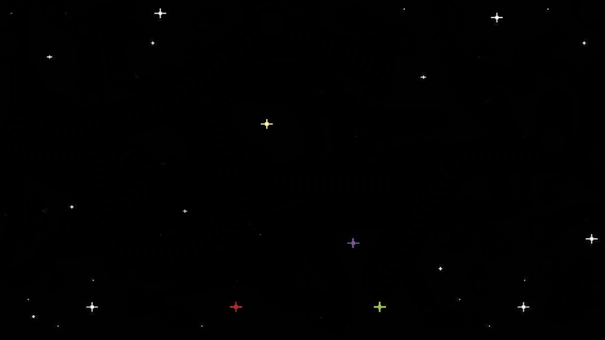
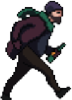
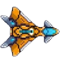
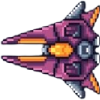
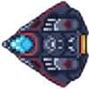
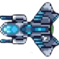

# Game project description:

## Video giới thiệu, chơi demo và giải thích các logic - thành phần của mã nguồn game: [Video tại đây.](https://drive.google.com/file/d/1Xa3WOWRzSIspU3g_cIG-J0yKHkOr47Ou/view?usp=sharing)

## Mục lục

### [I. Ý tưởng triển khai](#ytuong)
- [1. Nguồn tham khảo game:](#nguonthamkhaogame)
- [2. "Cốt truyện" chính của game](#cottruyen)
### [II. Cách tải](#cachtai)
	
### [III. Cách chơi](#cachchoi)
- [1. Điều khiển](#dieukhien)
- [2. Chức năng chính](#chucnang)
- [3. Bắt đầu chơi](#batdau)
### [IV. Nguồn tài nguyên tham khảo](#tainguyen)
- [Đồ họa](#dohoa)
- [Source code](#code)
### [V. Github project](#git)

### [VI. Quá trình làm game](#quatrinh)

===========================

## I.Ý tưởng triển khai:

1. `Nguồn tham khảo game`:
   - Nguồn game: tham khảo từ tựa game dino run và game bắn máy bay cổ điển.
   - Phần đầu (Running): game chạy, vượt chướng ngại vật tựa tựa dino game, cộng điểm khi vượt qua vật cản.
   - Phần sau (Flying): game lái máy bay, bắn kẻ địch, tính điểm và thắng khi đủ điểm.

2. `"Cốt truyện" chính của game`:
    bạn là một kẻ nghiện ngập ở Trái Đất và bị người ngoài hành tinh bắt đến một nơi kì lạ. Việc của bạn là chạy đến một kho chứa máy bay của chúng, đánh cắp một chiếc và trốn thoái khỏi hành tinh này. Nhưng để làm được việc đó, bạn phải vượt qua các chướng ngại vật trên đường đi và đội quân bảo vệ bầu trời của bọn chúng. Chúc may mắn !!

## II.Cách tải: 
+ Click chuột vào (1) và chọn tiếp (2):
+ Giải nén file zip đã tải.
+ Mở Code::Block, mở Game project thông qua file `DemoSDL.cbp`.
  
  
+ Tiến hành Build and run code và chơi.
+ 

## III. Cách chơi:

1. `Điều khiển`:
   - Chế độ RUNNING: ấn `SPACE` để nhảy.
   - Chế độ FLYING: `Key ⬆️, ⬇️, ⬅️, ➡️` di chuyển lên, xuống, trái, phải.
   - 

2. `Chức năng chính`:
   - Space: `nhảy` (RUNNING) và `bắn` (FLYING).
   

3. `Bắt đầu chơi`:
   - Tại màn hình START, click chuột trái vào `nút Start` hoặc ấn phím `S` để bắt đầu.
   - Nhấn `Space` để nhảy qua vật cản tại vị trí thích hợp.
   - Với mỗi mốc +=50 điểm đạt được thì tốc độ di chuyển của cả game sẽ nhanh hơn ban đầu.
   - Khi đạt mốc điểm `500` thì sẽ chuyển sang chế độ FLYING (game bắn máy bay). Máy bay của kẻ thù sẽ xuất hiện ngẫu nhiên bên phải màn hình, việc của bạn là ấn `Space` để bắn ra đạn tiêu diệt kẻ thù.
   - Mặc định bạn sẽ có 100 Hp, mỗi khi trúng đạn của địch sẽ bị -10 Hp.
     
   - Tính năng cải thiện game: với mỗi mốc điểm += 50 điểm đạt được, bạn sẽ nhận được ngẫu nhiên 1 trong 3 bổ trợ là: tăng tốc độ, bất tử và hồi máu ( hiệu ứng kéo dài trong 10 giây ).
   - Nếu:
     - Bạn bị kẻ địch bắn về 0 Hp --> Game Over.
     - Bạn va chạm trực tiếp với máy bay kẻ định khi không bất tử --> Game Over.
     - Bạn để máy bay địch bay chạm đến phía bên trái màn hình game --> Game Over.
     - Bạn tiêu diệt địch và tích điểm = 1500 điểm --> Victory !!!
   - Tại màn hình Game Over hoặc Victory, bạn có thể click chuột trái nào nút `Restart` hoặc ấn phím `Enter` để chơi lại.

## IV: Nguồn tài nguyên tham khảo:

1. `Đồ họa`:

	- Background:
		+ [Background Running]([(https://www.shutterstock.com/vi/image-vector/pixel-art-forest-background-seamless-game-2501937379): 

		+ [Background Flying](https://www.pinterest.com/pin/47076758601767224/): 
		+ Trang trí thêm:
			+ [Skulls and bones: ](https://i.pinimg.com/1200x/37/21/1a/37211af2ca68131d5709c2ced13a4653.jpg)
   			+ Mây: google.com.vn.
	- [Player (Running)](https://craftpix.net/freebies/free-homeless-character-sprite-sheets-pixel-art/)
 	- [Player - Enemy (Flying):  ](https://i.pinimg.com/736x/58/d5/95/58d595e683468aebf229ebc1e88c205a.jpg)
 	- [Bullet: ](https://www.spriters-resource.com/resources/sheets/25/27957.png)

2. `Source code`:
   + Background: https://lazyfoo.net/tutorials/SDL/31_scrolling_backgrounds/index.php
   + Docs.google: https://docs.google.com/document/d/1FZ3jTqHxtyZznNWiJmmve0zYu_aSliUqLP2OsMcdehQ/edit?tab=t.0#heading=h.g69r5ua9lzeh
   + https://lazyfoo.net/
   + [dev.uet.vnu.edu.vn](https://dev.uet.vnu.edu.vn/my/courses.php)
   + [youtube.com](https://www.youtube.com/)
   + [google.com](https://www.google.com/)
   + [stackoverflow.com](https://stackoverflow.com/questions)
   + chatgpt.com
   + grok.com
   + (các nguồn nhỏ lẻ khác...)

## V. Github project:
   + `File header (.h)`:
     + main.h: quản lý các trạng thái của game, kích cỡ cửa sổ game.
     + Player.h: khai báo lớp, hàm, hằng số, biến số và các cấu trúc.
     + Enemy.h: khai báo lớp, hàm, hằng số, biến số và các cấu trúc.
     + Object.h: khai báo lớp, hàm, hằng số, biến số và các cấu trúc.
     + Bullet.h: khai báo lớp, hàm, hằng số, biến số và các cấu trúc.
     + UI.h: khai báo lớp, hàm, hằng số, biến số và các cấu trúc.
   + `File source (.cpp)`:
     + main.cpp: chứa hàm main gồm logic chính của game, vẽ, xử lý sự kiện; #include các file header (.h) để sử dụng.
     + Player.cpp: triển khai các thuộc tính của Player.h, xử lí các logic.
     + Enemy.cpp: triển khai các thuộc tính của Enemy.h, xử lí các logic - hiệu ứng.
     + Object.cpp: triển khai các thuộc tính của Object.h, quản lý object xuất hiện.
     + Bullet.cpp: triển khai các thuộc tính của Bullet.h, xử lí các logic về đạn.
     + UI.cpp: triển khai các thuộc tính của UI.h, triển khai về viết - vẽ lên màn hình.
   + `File thư viện SDL2`:
     + SDL2.dll
     + SDL2_image.dll
     + SDl2_ttf.dl
   + `File tài nguyên về ảnh`:
     + `Ảnh background`: backgroundflying.png, backgroundrunning.png.
     + `Ảnh của Player`:
       + Running: playerun_1.png --> playerun_8.png.
       + Flying: playerfly_1.png.
     + `Ảnh của Enemy`: enemy_1.png --> enemy_3.png.
     + `Ảnh của Object`:
       + stone 1.png
       + stone 2.png
       + tree 1.png
       + tree 2.png
       + banana skin.png
     + `Ảnh của Bullet`:
       + bullet_enemy.png
       + bullet_player.png.
     + `Ảnh hiệu ứng nổ`:
       + boom_1.png
       + boom_2.png
       + boom_3.png.
     + `Các file khác`:
       + arial.ttf
       + ...
     + `Logic chính của game: ` kiểm tra sự va chạm giữa các đối tượng trong game:
       + Running: Axis-Aligned Bounding Box (AABB)
       + Flying: SDL_Rect + SDL_HasIntersection.

        
       

## VI. Quá trình làm game:
   - 12/03/2025:

                 + Xây dựng khung sườn cơ bản của game. Hoạt họa ban đầu của nhân vật, vật cản, kẻ địch và đạn bắn tạm thời đơn giản là hình ô vuông.
                 + Các nút cơ bản: Space: Nhảy (phần đầu)
                                          Bắn (phần sau).
                                   Key ⬆️ and ⬇️: di chuyển lên xuống (phần sau).
   - 15/03/2025:
   
                + Tách hàm của nhân vật, vật cản, kẻ địch và đạn thành các module riêng .h và .cpp. (có sử dụng AI trợ giúp)
   - 20/03/2025:
   
                 + Sử dụng kĩ thuật Scrolling Background cho chế độ Running - nguồn https://lazyfoo.net/tutorials/SDL/31_scrolling_backgrounds/index.php.
   
   - 09/04/2025:
   
                 + Sử dụng kĩ thuật Scrolling Background cho chế độ Flying.
                 + Thêm ảnh cho các lớp Player, Enenmy, Object và Bullet.
                 + Up ảnh cho các lớp Player, Enenmy, Object và Bullet.
                 + Tạo hàm random ảnh cho việc spawn object (running) và enemy (flying).
                 + Xử lý lại kích thước width và height của lớp Player.
                 + Xử lý lại logic va chạm của cả 2 chế độ.
                 + Tạo thêm file main.h để quản lý chế độ chơi dễ hơn.
   - 13/04/2025:
     
                 + Thêm thuộc tính máu vào lớp Player.
                 + Thêm khả năng bắn cho Enemy.
                 + Thêm và up ảnh vụ nổ của Enemy khi bị bắn trúng.
                 + Thêm khả năng bắn từ 2 phía cho lớp Player.
                 + Thêm quản lý đạn sao cho phù hợp về thời gian giữa các lần bắn.
                 + Xử lý lại logic va chạm giữa đạn với player và enemy.
   - 15/04/2025:
   
                 + Cài đặt SDL2_ttf.
                 + Tạo giao diện UI gồm GameStart và GameOver.
                 + Thêm nút Start và nút Restart.
                 + Hiển thị điểm đạt được, thêm thanh máu cho nhân vật ở chế độ FLYING.
   - 20/04/2025:

                 + Tăng độ khó cho game bằng cách tăng tốc độ chạy của nhân vật khi đạt mức điểm +=50.
                 + Điều chỉnh lại hoạt ảnh chạy của nhân vật.
                 + Điều chỉnh lại Object.
   - 24/04/2025: Big updates:

                 + Thêm chức năng di chuyển 4 hướng: lên, xuống, trái, phải.
                 + Thêm buff ngẫu nhiên mỗi mốc 50 điểm: Tăng tốc độ, bất tử và hồi máu (10 giây - 2 máu / giây).
                 + Thêm màn hình Victory ( điều kiện thắng là điểm >= 1000 điểm ).
                 + Sửa lại UI.h và Ui.cpp để hiện buff đang có.
                 + Tăng độ khó cho game bằng cách: tăng tốc độ spawn Enemy, tăng tốc độ bắn của Enemy sau mỗi mốc 50 điểm trong chế độ Flying.
                 + Thêm điều kiện Game Over: nếu bị miss và để Enemy đi ra ngoài màn hình hoặc đâm vào Player.
                 + Cập nhật lớp Player.
                 + Cập nhật lớp Object ( giảm thời gian spawn vật cản sau mỗi mốc 50 điểm ).
                 + ....
   - 26/04/2025: `Update lần cuối, chính thức hoàn thiện game.` Tự đánh giá: game còn hơi đơn giản, còn nhiều chỗ chưa hợp lý, không có âm thanh...
     
     
   
